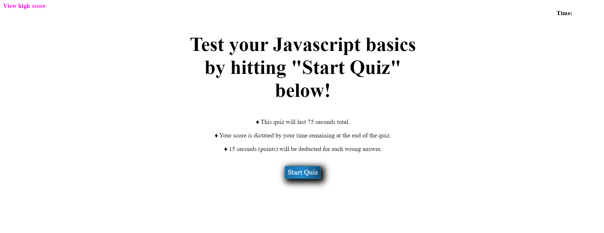

# 04-Quiz-Generator

## <strong>Description</strong>

For Module 4, we are tasked to create a quiz with specific criteria labelled below

## <strong>Acceptance Criteria</strong>

♦ When clicking the start button, a timer starts and a question is presented

♦ When an answer is provided, another question follows immediately

♦ If the question is wrong, time is subtracted from the clock

♦ Game is over when timer reaches 0

♦ When game is over, initals can be entered and score is documented

## <strong>Criteria Met</strong>

♦ Quiz provides a time question/answer scenario

♦ Quiz finalizes with a "highscore" screen for documentation of scores

### <strong>Website Link</strong>

https://github.com/FleischmanJ88/04-Quiz-Generator

### <strong>Screenshot</strong>

### <strong>Contact Information</strong>

https://github.com/FleischmanJ88